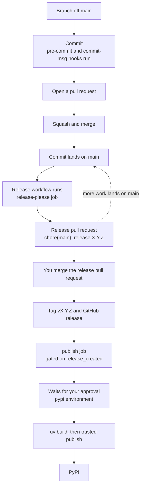

# Contributing

## Setup

You need [uv](https://docs.astral.sh/uv/).
Everything else installs from the lockfile.

```sh
uv sync
uv run prek install -f
```

The second command writes two git hooks: `pre-commit` runs the linters, `commit-msg` checks the commit format.
Re-run it with `-f` any time `default_install_hook_types` changes in `prek.toml`, because the hook files are copies, not links.

## Checks

The hooks run on staged files at commit time.
To run everything against the whole repo:

```sh
uv run prek run --all-files
```

Individual tools, when you want a faster loop:

| Command | Covers |
| --- | --- |
| `uv run ruff check --fix` | Python lint |
| `uv run ruff format` | Python and Markdown formatting |
| `uv run pyrefly check` | Type checking |
| `uv run rumdl check --fix` | Markdown |
| `uv run tombi lint` | TOML |
| `uv run pytest` | Tests |

Most hooks fix in place, so a failed commit often just needs `git add` and a retry.

## Tests

Tests live in `tests/` and `uv run pytest` runs them.
The `pytest` hook runs the whole suite on every commit, not only on commits that stage a Python file.
Deleting `src/epistole/py.typed` is the case that forces this.
No file-type filter matches that path, so a filtered hook would not run the suite, and the test that checks for the marker would never fail.

Annotate every test parameter, including fixtures and `parametrize` values.
Ruff never asks for this, because `ruff.toml` turns off `ANN` under `**/tests/**`.
Pyrefly does ask, because `preset = "strict"` reports an unannotated parameter as `implicit-any-parameter`, and `pyrefly.toml` sets no exception for tests.
That difference is deliberate.
An annotated fixture lets pyrefly check the test body against the real type, so a misspelled field name fails `pyrefly check` instead of reaching the test run.

Return annotations are the part of `ANN` you do skip.
`-> None` on every test function says nothing.

## Prose

The package has two spellings in prose, and each means one thing.

- **Epistole** is the name.
  Use it in running text: "Epistole sends the same message through any backend."
- **`epistole`** is the identifier, in code formatting.
  Use it for the distribution, the module, and the command: `pip install epistole`, `import epistole`.

Never write bare "epistole" in a sentence, and never any other variation such as "EPISTOLE" or "epistole.py".

## Commits

Commit messages follow [Conventional Commits](https://www.conventionalcommits.org/), enforced by the `commit-msg` hook in strict mode.

```text
<type>(<optional scope>): <description>
```

The type decides what happens at release time:

| Type | Changelog section | Version while below 1.0.0 |
| --- | --- | --- |
| `feat` | Features | patch bump |
| `fix` | Bug Fixes | patch bump |
| `perf` | Performance | patch bump |
| `docs` | Documentation | patch bump |
| `deps` | Dependencies | patch bump |
| `revert` | Reverts | patch bump |
| `refactor`, `test`, `build`, `ci`, `style`, `chore` | hidden | patch bump |

A `!` after the type, or a `BREAKING CHANGE:` footer, bumps the minor while the version is below 1.0.0.

That column is deliberately conservative, and it comes from two settings in `release-please-config.json`:

```json
"bump-minor-pre-major": true,
"bump-patch-for-minor-pre-major": true
```

Without them a single `feat!:` would take 0.x straight to 1.0.0.
With them, nothing reaches 1.0.0 until you say so with a `Release-As: 1.0.0` commit footer.
Once the project is past 1.0.0, remove both settings and the usual rules apply: breaking bumps the major, `feat` bumps the minor.

Hidden types still land in the release, they just do not appear in `CHANGELOG.md`.
Edit `changelog-sections` in `release-please-config.json` to change that.

## Branches and pull requests

Nothing forces you to branch, but the release flow is identical either way.
Release-please only ever reads the commits that land on `main`.



One trap with squash merges.
GitHub builds the squash commit message from the pull request title, and the `commit-msg` hook only sees commits you make locally.
It never sees a pull request title.
So a branch full of valid commits can still land on `main` as `Update stuff (#4)`, which release-please cannot parse and silently ignores.

Title your pull requests in the conventional format, or pick merge commits over squash so your original messages survive.

## Releasing

Releases are automated.
You never edit `version` in `pyproject.toml`, `uv.lock`, or `CHANGELOG.md` by hand.

1. Merge your work to `main`.
2. [release-please](https://github.com/googleapis/release-please) opens or updates a pull request titled `chore(main): release X.Y.Z`, containing the version bump and the changelog entry.
3. Review that pull request.
   It rewrites itself as more work lands on `main`, so leave it open until you actually want to ship.
4. Merge it.
   That creates the git tag and the GitHub release, and starts the `publish` job.
5. Approve the deployment.
   The `pypi` environment lists you as a required reviewer, so the upload waits until you click through.

The publish job is gated on `release_created`, so ordinary pushes to `main` only maintain the release pull request and never publish.

### Never pass `release-type` to the action

Every release setting lives in `release-please-config.json`.
The workflow passes no inputs at all, and that is what makes the file load.

`release-please-action` branches on one input.
Set `release-type:` in its `with:` block and it builds its settings from action inputs alone, never opening `release-please-config.json`.
Nothing merges and nothing warns.
Release pull requests keep opening and keep looking right, so the loss surfaces a release or two later as a wrong changelog or a stale lockfile.

The input duplicates a value the file already sets, which is what makes it tempting.
Four of the six settings in that file have no action input at all: `bump-minor-pre-major`, `bump-patch-for-minor-pre-major`, `changelog-sections`, and `extra-files`.
The schema carries 34 per-package settings and the action exposes 4 of them.
Every input other than `release-type` is safe to add.

### Why `extra-files` points at `uv.lock`

uv records the project's own version in the lockfile as well as in `pyproject.toml`, so a release that touches only `pyproject.toml` leaves `uv lock --check` failing.
The `extra-files` entry bumps both together.

Its JSONPath reads like a typo and is not one:

```json
"$.package[?(@.name.value=='epistole')].version"
```

release-please parses TOML into nodes shaped `{start, end, value}`, so the filter has to reach through `.name.value`.
The write path then works on plain JSON, so the target has to stay `.version`.
Making the two agree looks like the fix and silently stops the update.

### Why publishing lives in the same workflow

Events triggered by the default `GITHUB_TOKEN` do not start new workflow runs.
A separate workflow listening for `release: published` would never fire, because release-please creates that release with the default token.
Keeping both jobs in one file avoids needing a personal access token.

### One-time PyPI setup

Publishing uses [trusted publishing](https://docs.pypi.org/trusted-publishers/), so there is no API token anywhere.
It needs two things that live outside this repo.

A pending publisher on PyPI:

| Field | Value |
| --- | --- |
| PyPI Project Name | `epistole` |
| Owner | `ozanozbeker` |
| Repository name | `epistole` |
| Workflow name | `release.yml` |
| Environment name | `pypi` |

And a GitHub environment named `pypi`, which is also where you would add a required reviewer if you want a manual gate before upload.
