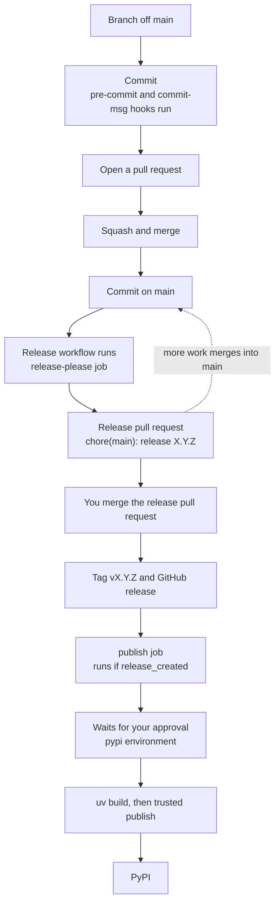

# Contributing

## Setup

You need [uv](https://docs.astral.sh/uv/).
The first command installs everything else from the lockfile.

```sh
uv sync
uv run prek install -f
```

The second command writes two git hooks.
`pre-commit` runs the linters.
`commit-msg` checks the commit format.
Re-run it with `-f` any time `default_install_hook_types` changes in `prek.toml`, because the hook files are copies, not links.

## Checks

The hooks run on staged files at commit time.
Run everything against the whole repo with:

```sh
uv run prek run --all-files
```

Run an individual tool when you want a faster loop:

| Command | Covers |
| --- | --- |
| `uv run ruff check --fix` | Python lint |
| `uv run ruff format` | Python and Markdown formatting |
| `uv run pyrefly check` | Type checking |
| `uv run rumdl check --fix` | Markdown |
| `uv run tombi lint` | TOML |
| `uv run pytest` | Tests |

Most hooks fix files in place.
After a failed commit, `git add` and a retry are often enough.

## Tests

Tests are in `tests/`.
`uv run pytest` runs them.
The `pytest` hook runs the whole suite on every commit, not only on commits that stage a Python file.
A commit that deletes `src/epistole/py.typed` needs this.
No file-type filter matches that path, so a filtered hook would not run the suite.
The test that checks for the marker would then never fail.

Annotate every test parameter, including fixtures and `parametrize` values.
Ruff never enforces this, because `ruff.toml` turns off `ANN` under `**/tests/**`.
Pyrefly does enforce it, because `preset = "strict"` reports an unannotated parameter as `implicit-any-parameter`.
`pyrefly.toml` sets no exception for tests.
That difference is deliberate.
An annotated fixture lets pyrefly check the test body against the real type, so a misspelled field name fails `pyrefly check` before the tests run.

Skip the return-annotation part of `ANN`.
`-> None` on every test function adds no information.

## Prose

The package has two spellings in prose.
Each means one thing.

- **Epistole** is the name.
  Use it in running text: "Epistole sends the same message through any backend."
- **`epistole`** is the identifier, in code formatting.
  Use it for the distribution, the module, and the command: `pip install epistole`, `import epistole`.

Never write bare "epistole" in a sentence.
Never write any other variation, such as "EPISTOLE" or "epistole.py".

## Commits

Commit messages follow [Conventional Commits](https://www.conventionalcommits.org/).
The `commit-msg` hook enforces the format in strict mode.

```text
<type>(<optional scope>): <description>
```

The type sets what happens at release time:

| Type | Changelog section | Version while below 1.0.0 |
| --- | --- | --- |
| `feat` | Features | patch bump |
| `fix` | Bug Fixes | patch bump |
| `perf` | Performance | patch bump |
| `docs` | Documentation | patch bump |
| `deps` | Dependencies | patch bump |
| `revert` | Reverts | patch bump |
| `refactor`, `test`, `build`, `ci`, `style`, `chore` | hidden | patch bump |

A `!` after the type, or a `BREAKING CHANGE:` footer, bumps the minor while the version is below 1.0.0.

That column is deliberately conservative.
Two settings in `release-please-config.json` set it:

```json
"bump-minor-pre-major": true,
"bump-patch-for-minor-pre-major": true
```

Without them, a single `feat!:` would bump 0.x straight to 1.0.0.
With them, the version stays below 1.0.0 until you add a `Release-As: 1.0.0` commit footer.
Once the project is past 1.0.0, remove both settings.
The usual rules then apply: a breaking change bumps the major, and `feat` bumps the minor.

The release still includes commits of hidden types, but `CHANGELOG.md` does not list them.
Edit `changelog-sections` in `release-please-config.json` to change that.

## Branches and pull requests

Nothing forces you to branch.
The release flow is identical either way.
Release-please reads only the commits on `main`.



Squash merges have one risk.
GitHub builds the squash commit message from the pull request title.
The `commit-msg` hook checks only commits you make locally, never a pull request title.
So a branch full of valid commits can still merge into `main` as `Update stuff (#4)`.
Release-please cannot parse that message and silently ignores it.

Title your pull requests in the conventional format.
Otherwise, pick merge commits over squash, so the history keeps your original messages.

## Releasing

Releases are automated.
You never edit `version` in `pyproject.toml`, `uv.lock`, or `CHANGELOG.md` by hand.

1. Merge your work to `main`.
2. [release-please](https://github.com/googleapis/release-please) opens or updates a pull request titled `chore(main): release X.Y.Z`.
   It contains the version bump and the changelog entry.
3. Review that pull request.
   Release-please rewrites it as more work merges to `main`, so leave it open until you want to ship.
4. Merge it.
   That creates the git tag and the GitHub release, and starts the `publish` job.
5. Approve the deployment.
   The `pypi` environment lists you as a required reviewer, so the upload waits for your approval.

The publish job runs only when `release_created` is true.
So ordinary pushes to `main` only update the release pull request and never publish.

### Never pass `release-type` to the action

Every release setting is in `release-please-config.json`.
The workflow passes no inputs at all, so the action loads the file.

`release-please-action` branches on one input.
If you set `release-type:` in its `with:` block, it builds its settings from action inputs alone.
It never opens `release-please-config.json`.
It does not merge the two sources.
It prints no warning.
Release pull requests still open and still look right.
You find the loss a release or two later, as a wrong changelog or a stale lockfile.

The input is tempting because it duplicates a value the file already sets.
Four of the six settings in that file have no action input at all: `bump-minor-pre-major`, `bump-patch-for-minor-pre-major`, `changelog-sections`, and `extra-files`.
The schema defines 34 per-package settings, and the action exposes 4 of them.
Every input other than `release-type` is safe to add.

### Why `extra-files` points at `uv.lock`

uv records the project's own version in the lockfile as well as in `pyproject.toml`.
So a release that changes only `pyproject.toml` makes `uv lock --check` fail.
The `extra-files` entry bumps both together.

Its JSONPath looks like a typo, but it is not one:

```json
"$.package[?(@.name.value=='epistole')].version"
```

release-please parses TOML into nodes shaped `{start, end, value}`, so the filter has to match on `.name.value`.
The write path then works on plain JSON, so the target has to stay `.version`.
Making the two agree looks like the fix, but it silently stops the update.

### Why publishing runs in the same workflow

Events triggered by the default `GITHUB_TOKEN` do not start new workflow runs.
A separate workflow triggered by `release: published` would never run, because release-please creates that release with the default token.
Keeping both jobs in one file avoids needing a personal access token.

### One-time PyPI setup

Publishing uses [trusted publishing](https://docs.pypi.org/trusted-publishers/), so there is no API token anywhere.
It needs two things outside this repo.

The first is a pending publisher on PyPI:

| Field | Value |
| --- | --- |
| PyPI Project Name | `epistole` |
| Owner | `ozanozbeker` |
| Repository name | `epistole` |
| Workflow name | `release.yml` |
| Environment name | `pypi` |

The second is a GitHub environment named `pypi`.
If you want a manual approval before upload, add a required reviewer to that environment.
